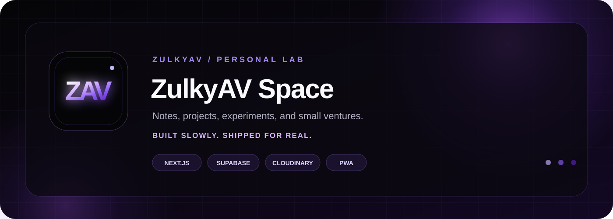
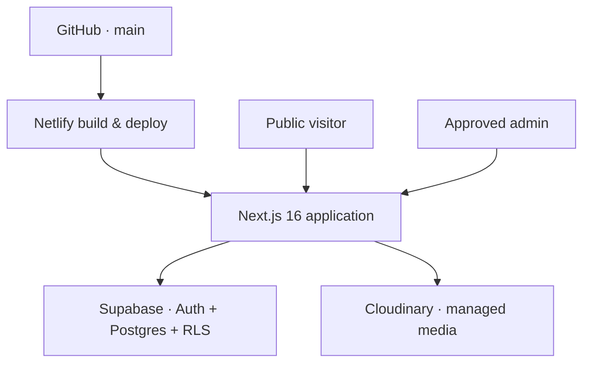

<p align="center">
  
</p>

<p align="center">
  <a href="https://zulkyav-site.netlify.app">
    
  </a>
  <a href="https://github.com/ZulkyAV/ZulkyAV-Space">
    
  </a>
  
</p>

<p align="center">
  A dark personal space for unfinished ideas, strange experiments,<br />
  practical builds, and small ventures slowly taking shape.
</p>

---

## About the space

**ZulkyAV Space** is a personal website, project archive, writing corner, and small digital storefront in one place. It is designed around a dark abyss-inspired interface with purple accents, while keeping the content manageable from a private admin workspace.

This is where I document things I build—web experiments, Expert Advisors, indicators, ESP32 projects, notes, and products that are ready to share.

> [!NOTE]
> This repository powers the live website at **[zulkyav-site.netlify.app](https://zulkyav-site.netlify.app)**.

## Explore

| Space | What lives there |
| --- | --- |
| **Notes** | Folder-based writing, ideas, stories, and unfinished thoughts. |
| **Projects** | EA, indicators, ESP32 builds, web experiments, galleries, and flexible project links. |
| **Shop / Jualan** | Products with live stock, pricing, and WhatsApp order or consultation actions. |
| **Statistics** | Focused business summaries without exposing private transaction details publicly. |
| **Private Zone** | Approved-admin workspace for content, folders, stock, media, profile, and settings. |
| **PWA** | Installable web app experience with custom ZAV branding and an offline fallback. |

## System map



## Built with

<p>
  
  
  
  
  
  
  
</p>

- **Next.js App Router** for public pages, server rendering, metadata, and admin actions.
- **Supabase** for authentication, PostgreSQL data, and Row Level Security.
- **Cloudinary** for managed project, product, and profile media.
- **Netlify** for production builds and GitHub-based deployments.
- **Service Worker + Web Manifest** for the installable PWA experience.

## Core features

- Folder-based Notes, Projects, and Shop content.
- Flexible project action buttons such as **Download EA**, **Open Website**, or **View ESP32 Build**.
- Project cover images and multi-image galleries.
- Product stock, pricing visibility, labels, and private product fields.
- Direct WhatsApp order messages containing the selected product and price.
- Admin-only create, update, archive, and permanent-delete controls.
- Managed Cloudinary cleanup when project or product media is replaced or deleted.
- Password, OTP, approved-admin checks, and Supabase RLS.
- Responsive dark interface for desktop and mobile.
- Installable PWA with custom ZAV icons and offline fallback.

## Project structure

```text
src/
├── app/
│   ├── admin/          # Private Zone and server actions
│   ├── jualan/         # Public shop
│   ├── note/           # Public notes
│   ├── project/        # Public projects
│   └── statistics/     # Public statistics
├── components/         # Shared UI and admin components
├── lib/                # Supabase, Cloudinary, auth, and data access
└── types/              # Shared TypeScript models

public/                 # ZAV branding, PWA icons, and service worker
supabase/migrations/    # Database schema and incremental migrations
```

## Run locally

```bash
git clone https://github.com/ZulkyAV/ZulkyAV-Space.git
cd ZulkyAV-Space
npm install
```

Create a private `.env.local` file in the project root:

```env
NEXT_PUBLIC_SUPABASE_URL=
NEXT_PUBLIC_SUPABASE_PUBLISHABLE_KEY=
SUPABASE_SECRET_KEY=

NEXT_PUBLIC_CLOUDINARY_CLOUD_NAME=
CLOUDINARY_API_KEY=
CLOUDINARY_API_SECRET=
```

Then start the development server:

```bash
npm run dev
```

Open **[http://localhost:3000](http://localhost:3000)**.

> [!IMPORTANT]
> Never commit `.env` or `.env.local`. Keep `SUPABASE_SECRET_KEY` and `CLOUDINARY_API_SECRET` server-only.

## Database and deployment

1. Create a Supabase project.
2. Run the SQL files in `supabase/migrations/` in filename order.
3. Add the required environment variables to Netlify.
4. Connect Netlify to this repository and deploy the `main` branch.
5. Add the final Netlify URL to Supabase Authentication URL Configuration.

Every merge to `main` triggers a fresh Netlify deployment.

## Build check

```bash
npm run build
```

## Author

Built slowly by **[ZulkyAV](https://github.com/ZulkyAV)**.

<p>
  <a href="https://zulkyav-site.netlify.app">Website</a>
  ·
  <a href="https://github.com/ZulkyAV">GitHub</a>
</p>
